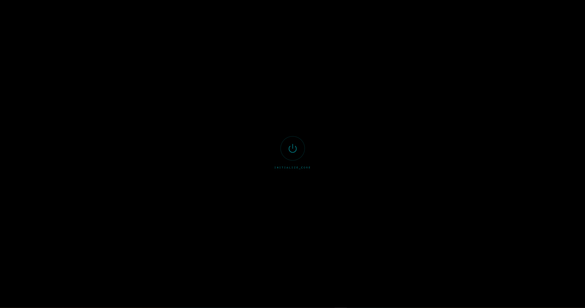
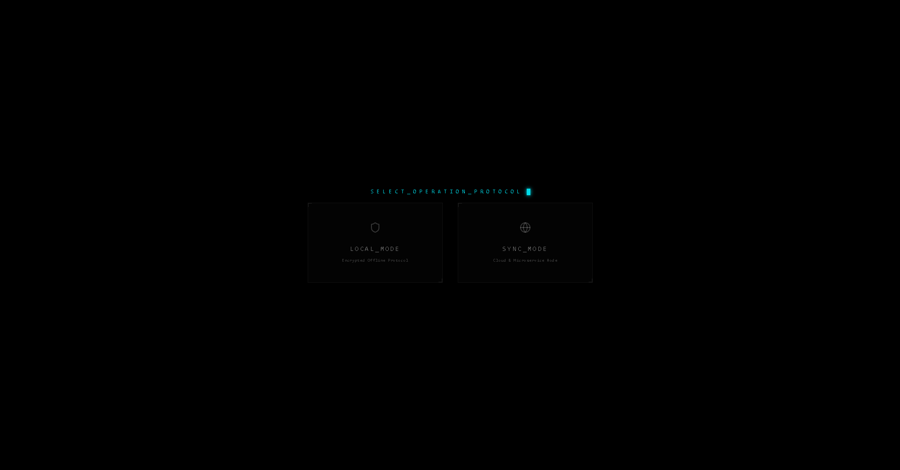
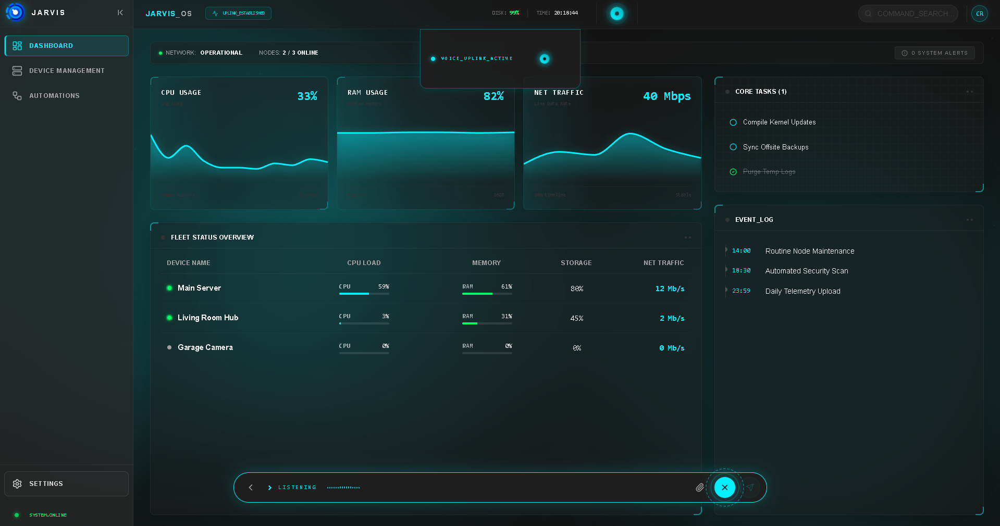
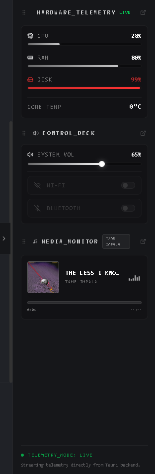
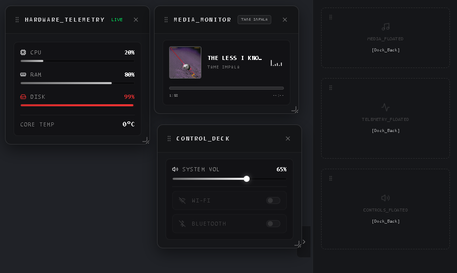
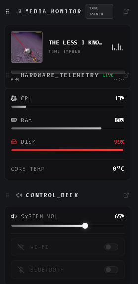
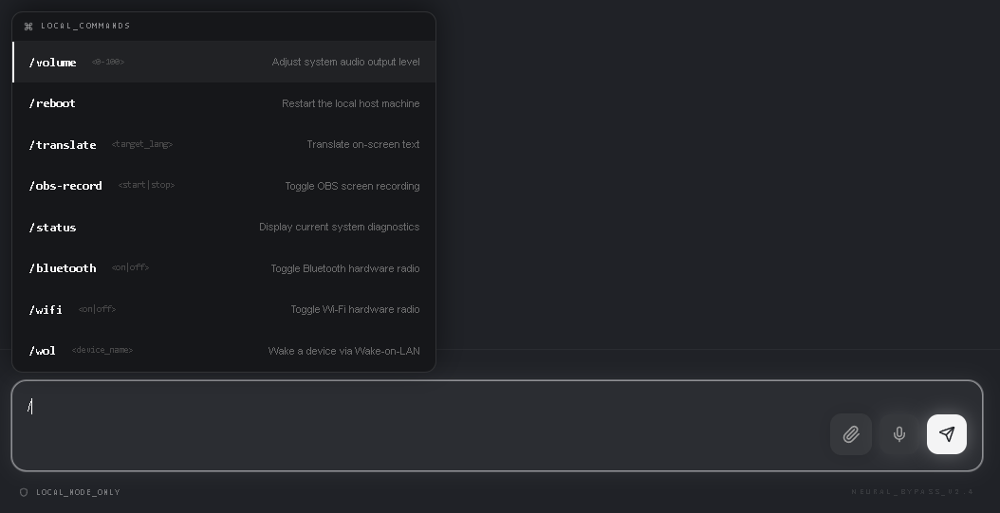
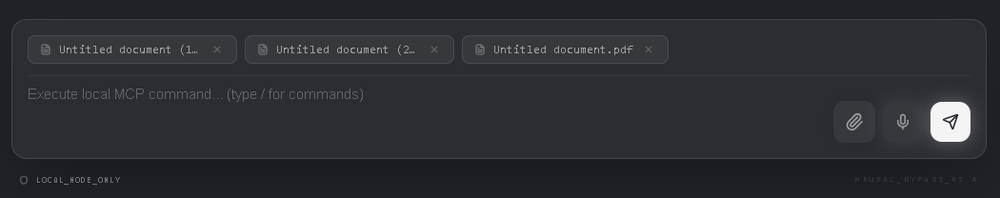
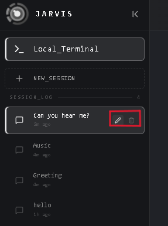
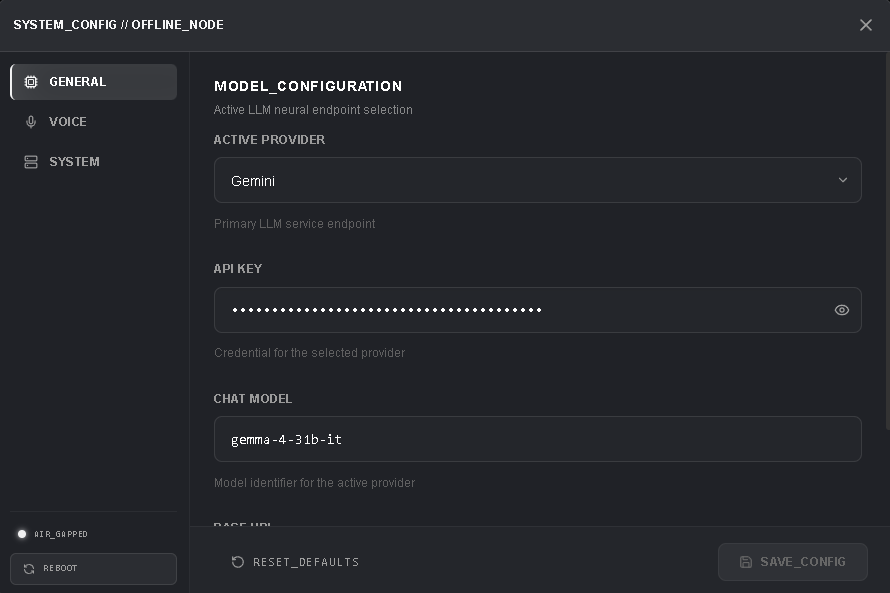

# JARVIS: AI-Enabled Home & Desktop Assistant

JARVIS is a powerful, low-latency, and beautifully designed AI-enabled home and desktop assistant. Built as a desktop application using **Tauri v2**, **React**, **TypeScript**, and **Rust**, JARVIS is engineered for performance, privacy, and extensibility.


---

## 📌 Implementation Status

### 🟢 Local Mode (Fully Active)
* **Encrypted Offline Protocol**: Full local execution prioritizing privacy.
* **AI & MCP Integrations**: High-performance local AI coordination using `agent_rs` and `rig-core`.
* **Parakeet Transcription**: Real-time voice listening and local speech-to-text processing using the Parakeet model.
* **Telemetry HUD**: Real-time monitoring of local CPU, RAM, and network statistics using Rust's `sysinfo` and rendered via interactive, fluid Recharts components.
* **Session Management**: Full persistence of chat histories and sessions stored locally in a SQLite database.

### 🟡 Sync Mode (Future Roadmap)
* **Cloud & Fleet Synchronicity**: Coordinate and monitor multiple linked nodes.
* **Device Management & WOL**: Remotely link new devices and wake them via Wake on LAN (WOL).
* **Distributed Automation**: Create, edit, and orchestrate automation routines across your local node fleet.

---

## 📸 Interface & Feature Gallery

### 1. Boot & Mode Protocol Selection
When JARVIS boots, users are prompted with a secure, styled protocol selection overlay to activate either **Local Mode** or **Sync Mode**.

| Startup Interface | Protocol Selection |
| :---: | :---: |
|  |  |

| Local Mode (Offline Conversation Interface) | Sync Mode (Online Dashboard Preview) |
| :---: | :---: |
|  |  |

---

### 2. Main Dashboard & Local Telemetry HUD
Once inside Local Mode, users have a split terminal-style chat interface on the left and a collapsible **Telemetry HUD** on the right, providing live performance metrics.

| Collapsible HUD Overview | Custom Metrics Graphs |
| :---: | :---: |
|  |  |

> *Tip: The HUD can be collapsed or rearranged dynamically for a tailored developer workspace.*
> 

---

### 3. AI Copilot Chat & Session Management
JARVIS includes a robust session manager allowing users to rename, create, or delete separate local conversations. File attachment support and MCP tool integrations allow rich commands.

| Chat with MCP Tools | File Attachment |
| :---: | :---: |
|  |  |

| Session List Manager | System Configuration |
| :---: | :---: |
|  |  |

---

## 🛠️ Technology Stack

### Frontend Architecture
* **Framework**: React 19 (Vite + TypeScript)
* **Styling**: Tailwind CSS v4 (Theme variables configured inside the `@theme` directive in `src/styles.css`, supporting dynamic, interchangeable skins like `theme-amber`, `theme-blue`, and `theme-red`).
* **Animations**: Framer Motion for premium micro-animations, fade-ins, and page transitions.
* **Visualization**: Recharts for live hardware graphs.
* **State Management**: Zustand stores.

### Backend Architecture (Rust)
* **Framework**: Tauri v2
* **Database**: SQLite (managed locally via `rusqlite` with bundled features).
* **Transcription**: Local speech-to-text powered by the `jarvis-transcriber` library and the **Parakeet** offline model.
* **Telemetry**: System diagnostics using the Rust `sysinfo` library.
* **Agents**: Integration with LLM frameworks via `agent_rs` and `rig-core`.

---

## 📂 Repository Structure

### Frontend (`src/`)
```text
src/
├── assets/          # JARVIS branding, icons, and UI sounds
├── components/      # Global, stateless/dumb UI elements (Gauges, Cards, Toggles)
├── features/        # Feature-based domain logic (MCP integrations, node fleet management)
├── hooks/           # useWebSocket, useHardwareStatus, useSystemData
├── layouts/         # DashboardLayout (Titlebar, Sidebar, Notifications)
├── lib/             # Third-party configuration profiles
├── pages/           # Thin route views (DashboardPage, ModeSelectionPage, OfflineDashboardPage)
├── services/        # Bridge layer calling Tauri commands and REST APIs
├── store/           # Global Zustand states (Active Nodes, AI Context)
├── styles.css       # Core Tailwind CSS v4 design tokens and layouts
└── types/           # TS Interfaces for Nodes, Devices, and MCP schemas
```

### Backend (`src-tauri/`)
```text
src-tauri/
├── src/
│   ├── commands/    # Tauri command controller handlers (chat, config, system, voice)
│   ├── domain/      # Configuration, database models, voice and system structs
│   ├── handlers/    # Background daemon workers and transcription loops
│   ├── infrastructure/ # System telemetry collectors and SQLite DB manager
│   ├── lib.rs       # App setup, state management, and command registration
│   └── main.rs      # Tauri boot entry point
└── tests/           # Integration and unit tests
```

---

## 🚀 Getting Started

### Prerequisites
* [Rust](https://www.rust-lang.org/tools/install) (latest stable toolchain)
* [Bun](https://bun.sh/) (recommended package manager) or Node.js

### 1. Clone & Install Dependencies
```bash
git clone https://github.com/skaarfundgandr/JARVIS.git
cd JARVIS
bun install
```

### 2. Run in Development Mode
To launch the desktop application:
```bash
bun run tauri dev
```
To run only the Vite frontend dev server (default port `1420`):
```bash
bun run dev
```

### 3. Build for Production
To bundle the desktop executable for your operating system:
```bash
bun run tauri build
```

---

## 💻 Developer Command Reference

### Rust Development
All Rust commands should be executed from within the `src-tauri/` directory.

```bash
# Check Rust compilation
cargo check

# Run backend unit and integration tests
cargo test

# Run Rust linter (Clippy)
cargo clippy --all-targets --all-features -- -D warnings

# Run Rust code formatter
cargo fmt --all
```

---

## 📄 License
This project is licensed under the MIT License - see the [LICENSE](LICENSE) file for details.
